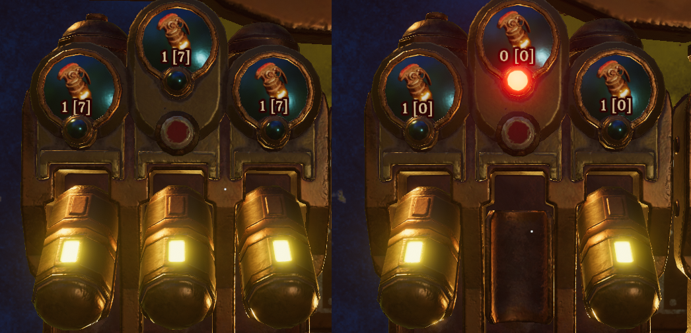

# Volcanoids Dispenser Shows "Loaded [Total]" Counts
Normally, dispensers only show the item count from storage. (Whatever item it's supposed to pull, it shows the count you have in storage.) 
It will **not** show the count of however many items are loaded in the dispenser.

This mod changes that display to format it like `X [Y]` where `X` is the amount loaded into the dispenser slot, and `Y` is the amount remaining in storage.

# Requirements
- Volcanoids obviously.

# Installation
It's on the workshop.